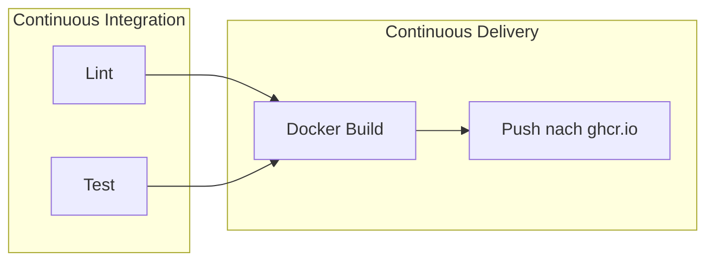

# Clean Infrastructure – CI/CD-Demo

Demo-Projekt für die Vorlesung **Clean Infrastructure**. Die Anwendung selbst ist bewusst trivial –
eine kleine Node.js-App, die eine statische Seite ausliefert. Der eigentliche Star ist die
**CI/CD-Pipeline**: Sie zeigt Continuous Integration und Continuous Delivery anhand eines
Docker-Images als Artefakt, inklusive verschiedener Tagging-Strategien.

> 💡 Die App zeigt unter `/` (bzw. `/api/info`) Version, Commit und Build-Zeitpunkt des laufenden
> Artefakts an. So lässt sich live demonstrieren, **welches** von der Pipeline gebaute Image
> gerade läuft.

## Die Pipeline

Definiert in [`.github/workflows/pipeline.yml`](.github/workflows/pipeline.yml):



**Continuous Integration** (`lint`, `test`) läuft bei *jedem* Push und Pull Request – schnelles
Feedback, parallele Jobs.

**Continuous Delivery** (`deliver`) läuft erst, wenn die CI grün ist (`needs: [lint, test]`).
Das Docker-Image wird immer gebaut (auch im PR, um das Dockerfile zu validieren), aber nur bei
einem Push auf `main` oder einem Versions-Tag in die Registry gepusht. Das Artefakt landet in der
**GitHub Container Registry** (`ghcr.io`) – ohne zusätzliche Secrets, der `GITHUB_TOKEN` reicht.

## Tagging-Strategien

Die Tags leitet [`docker/metadata-action`](https://github.com/docker/metadata-action) automatisch
aus dem Git-Kontext ab:

| Git-Ereignis | Image-Tags | Wozu? |
|---|---|---|
| Push auf `main` | `main`, `sha-<commit>`, `latest` | `main` = aktueller Stand des Branches, `sha-…` = exakt reproduzierbarer Build, `latest` = Convenience-Tag |
| Git-Tag `v1.2.3` | `1.2.3`, `1.2`, `1`, `sha-<commit>`, `latest` | Semver-Kaskade: Konsumenten wählen, wie viel Update sie automatisch mitnehmen (`1` = alle Minor/Patches, `1.2` = nur Patches, `1.2.3` = eingefroren) |
| Pull Request #7 | `pr-7` (nur Build, **kein** Push) | Dockerfile wird validiert, aber nichts ausgeliefert |

Kernaussage für die Vorlesung: **Ein Image, viele Tags.** Tags sind nur Zeiger auf dasselbe
Artefakt – `1.2.3` ist unveränderlich gedacht, `latest` und `1` wandern weiter.

## Demo-Drehbuch

1. **CI zeigen:** Pull Request öffnen → `Lint` und `Test` laufen parallel, das Image wird
   probeweise gebaut, aber nicht gepusht.
2. **Delivery zeigen:** PR auf `main` mergen → Pipeline pusht `main`, `sha-…` und `latest`.
3. **Release zeigen:**
   ```bash
   git tag v1.0.0
   git push origin v1.0.0
   ```
   → Pipeline pusht zusätzlich `1.0.0`, `1.0` und `1`.
4. **Artefakt konsumieren** (siehe [`docker-compose.yml`](docker-compose.yml)):
   ```bash
   docker compose up              # zieht :latest aus ghcr.io
   TAG=1.0.0 docker compose up    # exakt Version 1.0.0
   ```
   → <http://localhost:3000> zeigt Version + Commit des Images. Danach `v1.0.1` taggen und
   vorführen, wie `1.0` und `1` weiterwandern, `1.0.0` aber stehen bleibt – nur durch
   Wechsel der `TAG`-Variable, ohne irgendetwas neu zu bauen.

> Hinweis: Beim ersten Push legt GitHub das Package privat an. Für `docker pull` ohne Login das
> Package unter *Packages → clean-infrastructure → Package settings* auf **public** stellen.

## Starten & lokal entwickeln

Das fertige Artefakt aus der Registry starten (Konsumentensicht):

```bash
docker compose up                  # :latest
TAG=1.0.0 docker compose up        # bestimmte Version
# oder ohne Compose:
docker run -p 3000:3000 ghcr.io/realap/clean-infrastructure:latest
```

Aus dem Quellcode entwickeln (Produzentensicht):

```bash
npm install
npm start        # http://localhost:3000
npm test         # Tests (node:test, ohne Test-Framework-Zoo)
npm run lint     # ESLint
```

Docker-Build lokal nachstellen:

```bash
docker build -t clean-infrastructure-demo \
  --build-arg APP_VERSION=local \
  --build-arg GIT_SHA=$(git rev-parse --short HEAD) \
  --build-arg BUILD_TIME=$(date -u +%Y-%m-%dT%H:%M:%SZ) .
docker run -p 3000:3000 clean-infrastructure-demo
```

## Clean-Infrastructure-Details, die sich zu zeigen lohnen

- **Multi-Stage-Dockerfile:** Dependencies werden in einer eigenen Stage installiert; das
  Runtime-Image enthält weder Build-Tools noch Dev-Dependencies und läuft als `node`-User
  statt root.
- **`npm ci` statt `npm install`:** In der Pipeline wird exakt das Lockfile installiert –
  reproduzierbare Builds.
- **Build-Args als Herkunftsnachweis:** Version, Commit und Build-Zeit werden ins Image
  eingebrannt und von der App angezeigt – Nachvollziehbarkeit vom Commit bis zum Container.
- **`HEALTHCHECK` + `/healthz`:** Vorbereitung für Orchestrierung (Compose, Kubernetes).
- **Caching:** `cache: npm` im Setup-Node-Step und `type=gha`-Layer-Cache beim Docker-Build.
- In Produktion würde man Actions zusätzlich auf Commit-Digests pinnen
  (`uses: actions/checkout@<sha>`), hier steht Lesbarkeit im Vordergrund.

## Ausbaustufen für spätere Vorlesungen

1. **Backend dazu:** zweiter Service mit eigenem Dockerfile; in der Pipeline wird der
   Build-Job zur Matrix (`strategy.matrix.service: [frontend, backend]`) – zwei Artefakte,
   eine Pipeline.
2. **Continuous Deployment:** zusätzlicher Job, der das Image z. B. per SSH/Webhook oder
   GitOps (Argo CD, Flux) auf eine Umgebung ausrollt – inkl. Staging/Production-Unterscheidung
   über Environments.
3. **Supply-Chain-Härtung:** Image signieren (cosign), SBOM erzeugen, Vulnerability-Scan
   (Trivy) als weiterer CI-Job.
