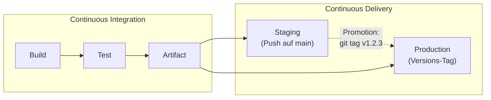

# Clean Infrastructure – CI/CD-Demo

Demo-Projekt für die Vorlesung **Clean Infrastructure**. Die Anwendung selbst ist bewusst trivial –
eine kleine Node.js-App, die eine statische Seite ausliefert. Der eigentliche Star ist die
**CI/CD-Pipeline**: Sie zeigt Continuous Integration und Continuous Delivery anhand eines
Docker-Images als Artefakt, inklusive verschiedener Tagging-Strategien.

> 💡 Die App zeigt unter `/` (bzw. `/api/info`) Version, Commit und Build-Zeitpunkt des laufenden
> Artefakts an. So lässt sich live demonstrieren, **welches** von der Pipeline gebaute Image
> gerade läuft.

## Die Pipeline

Definiert in [`.github/workflows/pipeline.yml`](.github/workflows/pipeline.yml):

Die Stufen folgen dem klassischen CI/CD-Modell
([github.com/resources/articles/ci-cd](https://github.com/resources/articles/ci-cd)):



**Continuous Integration** läuft bei *jedem* Push und Pull Request:

1. **Build** – Dependencies exakt nach Lockfile installieren (`npm ci`)
2. **Test** – statische Analyse (ESLint) und Tests (`node:test`)
3. **Artifact** – das Auslieferungs-Bundle bauen (`npm ci --omit=dev` + App-Code) und als
   Workflow-Artefakt (`app-bundle`) veröffentlichen

**Continuous Delivery** lädt genau dieses CI-Artefakt herunter und verpackt es in ein
Docker-Image – das Dockerfile führt keine Build-Schritte aus, und es wird ausgeliefert,
was getestet wurde:

- **Staging** – bei jedem Push auf `main`; Image-Tags `main`, `sha-…`, `staging`
- **Production** – nur bei einem Versions-Tag (`git tag v1.2.3`); Semver-Kaskade plus
  `latest` und `production`

Beide CD-Jobs nutzen [GitHub Environments](https://docs.github.com/actions/deployment/targeting-different-environments)
(`staging`, `production`) – sichtbar im *Deployments*-Tab des Repos. Das Artefakt landet in der
**GitHub Container Registry** (`ghcr.io`) – ohne zusätzliche Secrets, der `GITHUB_TOKEN` reicht.

## Tagging-Strategien

Die Tags leitet [`docker/metadata-action`](https://github.com/docker/metadata-action) automatisch
aus dem Git-Kontext ab:

| Git-Ereignis | Stufe | Image-Tags | Wozu? |
|---|---|---|---|
| Pull Request | nur CI | – (kein Image, nur das `app-bundle`-Artefakt) | schnelles Feedback, nichts wird ausgeliefert |
| Push auf `main` | Staging | `main`, `sha-<commit>`, `staging` | `staging` = wandernder Zeiger für die Staging-Umgebung, `sha-…` = exakt dieser Build |
| Git-Tag `v1.2.3` | Production | `1.2.3`, `1.2`, `1`, `sha-<commit>`, `latest`, `production` | Semver-Kaskade: Konsumenten wählen, wie viel Update sie automatisch mitnehmen (`1` = alle Minor/Patches, `1.2` = nur Patches, `1.2.3` = eingefroren) |

Kernaussage für die Vorlesung: **Ein Image, viele Tags.** Tags sind nur Zeiger auf dasselbe
Artefakt – `1.2.3` ist unveränderlich gedacht; `staging` wandert mit jedem Merge,
`latest` und `production` nur mit einem Release.

## Demo-Drehbuch

1. **CI zeigen:** Pull Request öffnen → `Build → Test → Artifact` laufen nacheinander;
   das `app-bundle` hängt als Download am Workflow-Run. Kein Image, keine Auslieferung.
2. **Staging zeigen:** PR auf `main` mergen → `CD · Staging` verpackt das CI-Artefakt und
   pusht `main`, `sha-…`, `staging`; im *Deployments*-Tab erscheint das Staging-Deployment.
3. **Production zeigen (Promotion per Tag):**
   ```bash
   git tag v1.0.0
   git push origin v1.0.0
   ```
   → `CD · Production` pusht `1.0.0`, `1.0`, `1`, `latest`, `production`.
   Extra-Demo: vorher unter *Settings → Environments → production* „Required reviewers"
   eintragen – der Job pausiert dann, bis jemand die Auslieferung freigibt.
4. **Artefakt konsumieren** (siehe [`docker-compose.yml`](docker-compose.yml)):
   ```bash
   docker compose up                # :latest = letztes Production-Release
   TAG=staging docker compose up    # aktueller Staging-Stand von main
   TAG=1.0.0 docker compose up      # exakt Version 1.0.0
   ```
   → <http://localhost:3000> zeigt Version + Commit des Images. Danach `v1.0.1` taggen und
   vorführen, wie `1.0`, `1` und `latest` weiterwandern, `1.0.0` aber stehen bleibt – nur
   durch Wechsel der `TAG`-Variable, ohne irgendetwas neu zu bauen.

> Hinweis: Beim ersten Push legt GitHub das Package privat an. Für `docker pull` ohne Login das
> Package unter *Packages → clean-infrastructure → Package settings* auf **public** stellen.

## Starten & lokal entwickeln

Das fertige Artefakt aus der Registry starten (Konsumentensicht):

```bash
docker compose up                  # :latest (= letztes Production-Release)
TAG=staging docker compose up      # aktueller Staging-Stand von main
TAG=1.0.0 docker compose up        # bestimmte Version
# oder ohne Compose:
docker run -p 3000:3000 ghcr.io/realap/clean-infrastructure:latest
```

Aus dem Quellcode entwickeln (Produzentensicht):

```bash
npm install
npm start        # http://localhost:3000
npm test         # Tests (node:test, ohne Test-Framework-Zoo)
npm run lint     # ESLint
```

Docker-Build lokal nachstellen (erst das Artefakt bauen – wie in der Pipeline,
das Dockerfile kopiert `node_modules` nur noch hinein):

```bash
npm ci --omit=dev
docker build -t clean-infrastructure-demo \
  --build-arg APP_VERSION=local \
  --build-arg GIT_SHA=$(git rev-parse --short HEAD) \
  --build-arg BUILD_TIME=$(date -u +%Y-%m-%dT%H:%M:%SZ) .
docker run -p 3000:3000 clean-infrastructure-demo
npm install   # danach Dev-Dependencies wiederherstellen
```

## Clean-Infrastructure-Details, die sich zu zeigen lohnen

- **Arbeitsteilung CI ↔ CD ↔ Dockerfile:** Die CI baut und veröffentlicht das Artefakt
  (`app-bundle`), die CD lädt **genau dieses Bundle** herunter und verpackt es – ausgeliefert
  wird, was getestet wurde, nichts wird neu gebaut. Das Dockerfile enthält kein `npm`; das
  Runtime-Image hat weder Build-Tools noch Dev-Dependencies und läuft als `node`-User statt
  root. (Die Alternative – ein Multi-Stage-Build, der hermetisch im Docker-Build installiert –
  ist ein guter Diskussionspunkt für die Vorlesung.)
- **GitHub Environments:** `staging` und `production` machen Auslieferungen im
  *Deployments*-Tab sichtbar; mit „Required reviewers" auf `production` wird aus der
  automatischen Auslieferung ein manueller Freigabeschritt (Continuous Delivery im engeren
  Sinn statt Continuous Deployment).
- **`npm ci` statt `npm install`:** In der Pipeline wird exakt das Lockfile installiert –
  reproduzierbare Builds.
- **Build-Args als Herkunftsnachweis:** Version, Commit und Build-Zeit werden ins Image
  eingebrannt und von der App angezeigt – Nachvollziehbarkeit vom Commit bis zum Container.
- **`HEALTHCHECK` + `/healthz`:** Vorbereitung für Orchestrierung (Compose, Kubernetes).
- **Caching:** `cache: npm` im Setup-Node-Step und `type=gha`-Layer-Cache beim Docker-Build.
- In Produktion würde man Actions zusätzlich auf Commit-Digests pinnen
  (`uses: actions/checkout@<sha>`), hier steht Lesbarkeit im Vordergrund.

## Ausbaustufen für spätere Vorlesungen

1. **Backend dazu:** zweiter Service mit eigenem Dockerfile; in der Pipeline wird der
   Build-Job zur Matrix (`strategy.matrix.service: [frontend, backend]`) – zwei Artefakte,
   eine Pipeline.
2. **Continuous Deployment:** zusätzlicher Job, der das Image z. B. per SSH/Webhook oder
   GitOps (Argo CD, Flux) auf eine Umgebung ausrollt – inkl. Staging/Production-Unterscheidung
   über Environments.
3. **Supply-Chain-Härtung:** Image signieren (cosign), SBOM erzeugen, Vulnerability-Scan
   (Trivy) als weiterer CI-Job.
